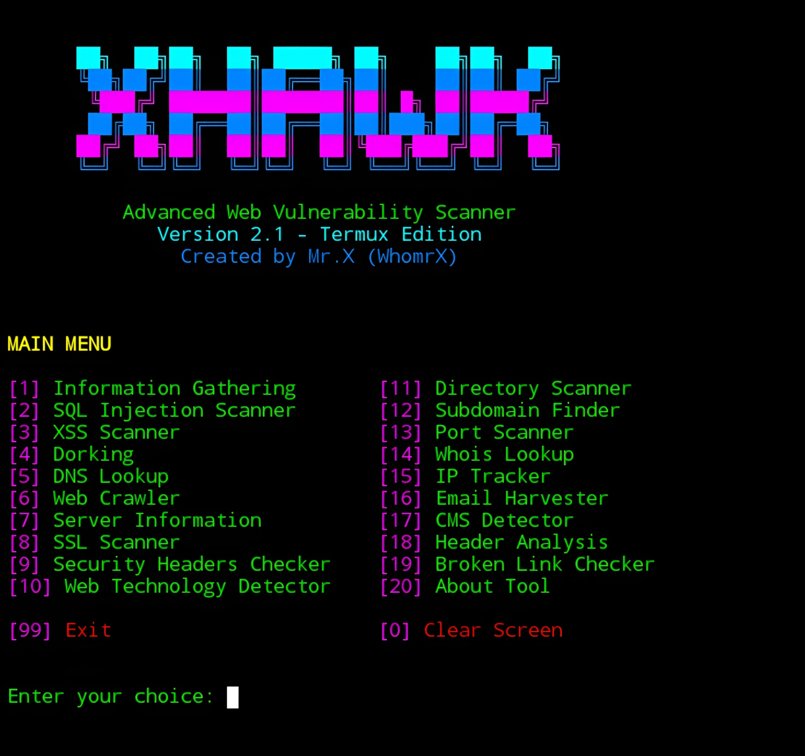

# Xhawk


## introduction
Xhawk is a tool Advanced Web Vulnerability Scanner used by professional cyber security experts inspired by redhawk.

## Instalations
```
$ pkg update -y && pkg upgrade -y
$ pkg install git -y
$ git clone https://github.com/Whomrx666/Xhawk.git 
$ cd Xhawk
$ python3 install.py

```
## Run manually
```
$ python3 Xhawk.py
```

## Instructions
- **First**: Install the tools according to the instructions above.
- **Second**: Run the main tools after installation.
- **Third**: Select one of the tools in the menu to search for vulnerabilities.
- **Four**: Enter the target domain or URL to perform a complete scan.
- **Last**: And yes you will get what you want

# Feature
| Main menu | ⚡ |
|--------|--------|
| **Information Gathering** | ✔️ |
| **SQL Injection Scanner** | ✔️ |
| **XSS Scanner** | ✔️ |
| **Dorking** | ✔️ |
| **DNS Lookup** | ✔️ |
| **Web Crawler** | ✔️ |
| **Server Information** | ✔️ |
| **SSL Scanner** | ✔️ |
| **Security Headers Checker** | ✔️ |
| **Web Technology Detector** | ✔️ |
| **Directory Scanner** | ✔️ |
| **Subdomain Finder** | ✔️ |
| **Port Scanner** | ✔️ |
| **Whois Lookup** | ✔️ |
| **IP Tracker** | ✔️ |
| **Email Harvester** | ✔️ |
| **CMS Detector** | ✔️ |
| **Header Analysis** | ✔️ |
| **Broken Link Checker** | ✔️ |
---------

## Observation
This is a tool for education only, I am not responsible for any misuse
### Original Author
<a href="https://github.com/Whomrx666"></a>

### <<< If you copy , Then Give me The Credits >>>

## CONNECT WITH ME :

[](https://whomrxhackers.blogspot.com/)
[](https://twitter.com/whomrx666)
[](https://wa.me/6285926601133?text=Halo%2C%20Mr.X)
[](https://www.facebook.com/whomrx.666)
[](https://t.me/Whomr_X)
[](mailto:whomrx666@gmail.com)
[](https://www.tiktok.com/@whomr.x)

**If you want to donate, click on the button**
<a href="https://saweria.co/whomrx"></a>

---

<p align="left">
  
</p>

---
